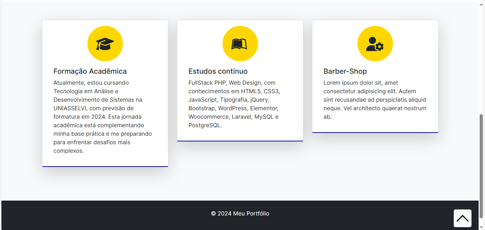

# Portfólio de Desenvolvedor Front-End

Bem-vindo ao meu portfólio de desenvolvedor front-end! Este projeto é uma demonstração do meu trabalho e habilidades como desenvolvedor web. 🔥🔥

## Índice

- [Descrição](#descrição)
- [Capturas de Tela](#capturas-de-tela)
- [Tecnologias Utilizadas](#tecnologias-utilizadas)
- [Instruções de Instalação](#instruções-de-instalação)
- [Uso](#uso)
- [Contribuição](#contribuição)
- [Licença](#licença)

## Descrição

Este projeto é um portfólio pessoal desenvolvido para exibir meus projetos, habilidades e informações de contato. É uma página estática criada com HTML, CSS e JavaScript, e foi projetada para ser responsiva e visualmente atraente.

## Capturas de Tela

## Tecnologias Utilizadas

Este projeto foi desenvolvido utilizando as seguintes tecnologias:

- **HTML5**: Utilizado para a estruturação do conteúdo da página.
- **CSS3**: Utilizado para estilizar e dar design à página.
- **JavaScript**: Utilizado para adicionar interatividade e funcionalidades à página.
- **Bootstrap**: Framework CSS utilizado para facilitar o desenvolvimento responsivo e o design da página.
- **Font Awesome**: Biblioteca de ícones utilizada para adicionar ícones à página.
- **Google Fonts**: Utilizado para importar fontes personalizadas para estilizar o texto da página.

Essas tecnologias foram escolhidas com base na sua popularidade, facilidade de uso e eficácia na criação de uma página web moderna e responsiva.

## Instruções de Instalação

1. Clone este repositório em sua máquina local.
2. Abra o arquivo `index.html` em seu navegador da web.

## Uso

- Navegue pelas diferentes seções para ver informações sobre mim, meus projetos e como entrar em contato.
- Clique nos links da barra de navegação para rolar suavemente até as seções correspondentes.

## Contribuição

Contribuições são bem-vindas! Se você quiser contribuir para este projeto, siga estas etapas:

1. Fork o repositório
2. Crie uma branch para sua feature (`git checkout -b feature/NovaFeature`)
3. Faça commit de suas mudanças (`git commit -am 'Adicione uma NovaFeature'`)
4. Faça push para a branch (`git push origin feature/NovaFeature`)
5. Abra um Pull Request

Por favor, certifique-se de que sua solicitação de pull descreve claramente as mudanças propostas e segue as diretrizes de contribuição.

## Licença

Este projeto está licenciado sob a [Licença MIT](./LICENSE).
